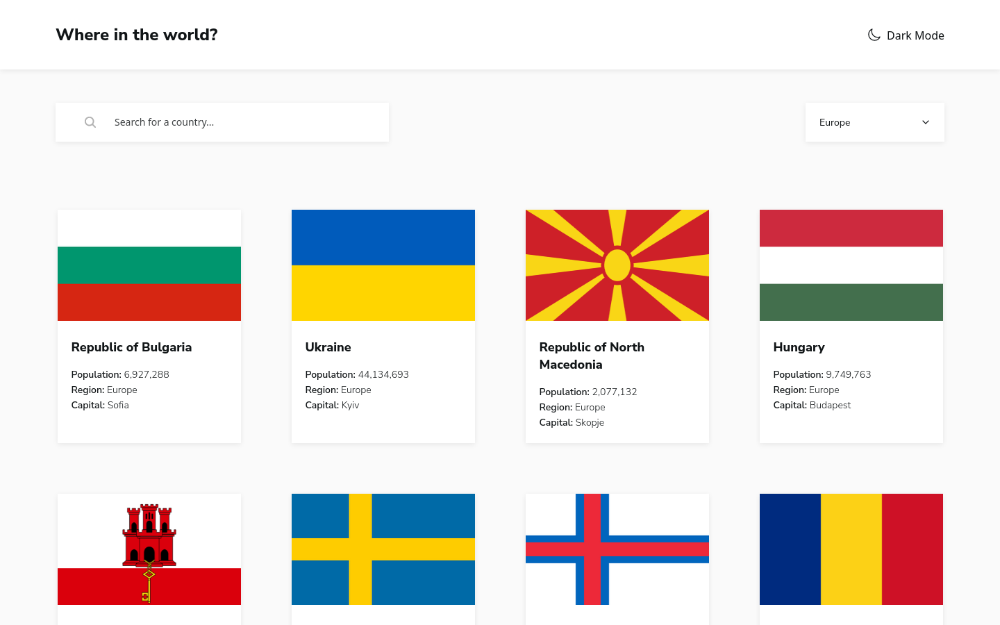

# REST Countries API using asynchronous JavaScript

Live Site URL: https://rest-apicountries.netlify.app/

### Built with

- Asynchronous JavaScript
- Lazy loading of images
- Mobile-first workflow
- Semantic HTML5 markup
- Flexbox/Grid layouts
- SASS

### Layout
The layout is implemented from a Figma design with the following screen sizes:
- Mobile 375 x 667
- Desktop 1440 x 900

What happens between those screen sizes is something entirely made up by me.

### The challenge

Users should be able to:

- See all countries from the API on the homepage
- Search for a country using an `input` field
- Filter countries by region
- Click on a country to see more detailed information on a separate page
- Click through to the border countries on the detail page
- Toggle the color scheme between light and dark mode *(optional)*

[Frontend mentor challenge](https://www.frontendmentor.io/challenges/rest-countries-api-with-color-theme-switcher-5cacc469fec04111f7b848ca)
### Screenshot

## Author

- Frontend Mentor - [hebrerillo](https://www.frontendmentor.io/profile/hebrerillo)

